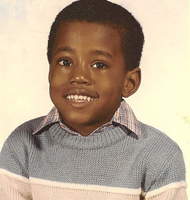

```{r, echo = F, out.width = 200, fig.align = "center", fig.retina = NULL}


```

&nbsp; <!-- inserting extra blank line -->  

# It Begins...

This whole thing started after I read an 
<a href="http://juliasilge.com/blog/If-I-Loved-NLP-Less/" target="_blank">excellent blog post by Julia Silge</a>. You should definitely check it out, but the short version is that she used language processing tools within R to analyze the sentiment in Jane Austen's novels. This led to the natural question: could I do this with rap albums? I didn't learn R coding just to write a dissertation, right?!

In the same way that Julia looked at Austen's entire body of work, I thought it would be interesting to look at one musical artist's whole commercial output. Within hip hop, Kanye seems like a natural choice. He's got seven albums out, which I'd argue encompass a greater musical diversity than probably any other recent, popular musician. Some of his later albums, particulalry *808s & Heartbreak* and *Yeezus* have been polarizing, even for fans of his early work. So his catalog seems ripe for a sentiment analysis. Would the sentiment analysis indicate major differences in feeling across his career arc? Is there really an 
<a href="http://www.hillydilly.com/2016/02/kanye-west-i-love-kanye-stefan-ponce-version/" target="_blank">"old Kanye" to miss</a>, lyrically speaking?

Anyways, what follows is my best shot at this analysis. Major credit to Julia Silge here. My work followed pretty easily from the code she had already written. And since we're dealing with hip hop here, let's not say I stole her code. I sampled it. I remixed it. If you don't care anything about how I actually did the analysis in R, you can skip **The Geeky Stuff** section and head right along to **The Rap Stuff**.

&nbsp; <!-- inserting extra blank line --> 

# The Geeky Stuff

In thinking about the general problem, it seemed to me there were three major steps to the analysis:

1.  Get the lyrics for the albums that I want to analyze. Julia already had this solved for her work because she had the text of Austen's novels packaged up nice and neat. I was starting from scratch.

2.  Perform the 
<a href="https://en.wikipedia.org/wiki/Sentiment_analysis" target="_blank">sentiment analysis</a>. Julia already solved this problem for me.

3.  Visualize the results. Julia mostly solved this problem for me.

Here's how I went about addressing these tasks:

1.  In thinking about how to get lyrics I wanted, the answer seemed pretty obvious to me: the website 
<a href="http://genius.com/" target="_blank">*Genius*</a> (formerly *Rap Genius*). If you haven't checked out *Genius*, you should. It's essentially a wiki-type site dedicated to song lyrics. Contributors both transcribe the lyrics and annotate them for meaning. For my purposes, I just needed to get the lyrics out of the webpages and into R, preferably for whole albums at once. To do this, I used the handy R package 
<a href="https://github.com/hadley/rvest" target="_blank">`rvest`</a>. It was my first time using it, but it allowed me to scrape lyrics off the web quickly and easily. I wrote a few R functions that allowed me to simply input the *Genius* page of the album I was interested in and pretty quickly process the entire album's worth of lyrics.

2.  For the sentiment analysis, I just followed Julia's lead. Major disclaimer: I know very little about sentiment analysis. My basic understanding is that it's used to quantify the subject feelings that are present in a written text. Julia has a nice comparison of metrics that might be used to compute sentiment scores, and she settled on the `bing` method from the package `syuzhet` since it did not seem to be biased or overly variable. Good enough for her, good enough for me.

3.  Again, I followed Julia's example here. I thought her visuals using `ggplot2` looked really nice, so I just modified her code slightly. Whereas Julia was analyzing an entire novel's worth of text at once, my texts had clear dividing points since an album is made up of discrete tracks. Thus, I added some visual elements to the plots to help distinguish between tracks within an album.

All these tasks can be done with surprisingly few R packages. Here's what I used:

```{r, message = F, warning = F}

library(dplyr)
library(rvest)
library(stringr)
library(syuzhet)
library(ggplot2)
library(png)
```

To summarize, I'm using `dplyr` for general data manipulation, `rvest` for web scraping, `stringr` for manipulation of lyrics once I get them into R, `syuzhet` to conduct the sentiment analysis, and `ggplot2` and `png` to create the plots.

``` {r, include = F}

# Define functions used in downstream analysis


# Take a Genius album page html and scrub it to get track htmls
# The artist's name is used in a regex search to find the htmls
# Note that this function will likely return more than just the track htmls
# since the Genius tracklist will often include credits and other extra
# links
get_track_htmls <- function(album_html, artist_name) {
  
  # Define the regex search to be used after the html is parsed
  regex_search <- paste0("http://genius.com/", artist_name, "-(.*)")
  
  # Get the html nodes containing track htmls
  results <- read_html(album_html) %>%
    html_nodes("a") %>%
    html_attr("href") %>%
    str_extract(regex_search)
  
  results[!is.na(results)]
}


# Take a Genius song parsed html and extract the lyrics from the page
# The output is split by line as it appears on the original webpage
# Also, convert the list (which only contains one element) to a vector
get_lyrics <- function(html) {
  
  html_node(html, "lyrics") %>%
    html_text(trim = T) %>%
    str_split("\n") %>%
    unlist()
}
  

# Take Genius lyrics and remove lines surrounded by brackets since
# these represent production information, artist information, and other
# metadata that should not be used in the sentiment analysis
remove_brackets <- function(text) {
  
  indexes <- sapply(1:length(text), 
                    function(x) is.na(str_match(text[x], "\\[|\\]")))
  text[indexes]
}


# Take Genius lyrics and remove blank lines
remove_blanks <- function(text) {
  
  indexes <- sapply(1:length(text), 
                    function(x) str_length(text[x]) > 0)
  text[indexes]
}


# Take a vector of htmls for a given album on Genius and get all the lyrics
# The resulting character vector contains the entire album's lyrics as well
# as a marker (e.g., "1marker", "2marker") inserted to help record 
# the track breaks
process_album <- function(htmls) {
  
  album <- vector(mode = "character", length = 0)
  
  for (i in 1:length(htmls)) {
    
    song <- read_html(htmls[i]) %>%
      get_lyrics() %>%
      remove_brackets() %>%
      remove_blanks()
    
   album <- c(album, paste0(i, "marker"), song)
  }
  
  return(album)
}


# This function modified from Julia Silge
# Take text and process the sentiment using a given method
process_sentiment <- function(rawtext, mymethod) {
  
  chunkedtext <- data_frame(x = rawtext) %>% 
    group_by(linenumber = ceiling(row_number() / 10)) %>% 
    summarize(text = str_c(x, collapse = " "))
  
  mySentiment <- 
    data.frame(cbind(linenumber = chunkedtext$linenumber, 
                     sentiment = get_sentiment(chunkedtext$text, 
                                               method = mymethod)))
}


# This function modified from Julia Silge
# Chunk the text
chunk_text <- function(rawtext) {
  
  chunkedtext <- data_frame(x = rawtext) %>% 
    group_by(linenumber = ceiling(row_number() / 10)) %>% 
    summarize(text = str_c(x, collapse = " "))
}


# Take a chunked text (after process_album and chunk_text)
# and a vector of album htmls and return the chunked text vector elements 
# that contain a track break
get_track_splits <- function(chunkedtext, album_htmls) {
  
  indexes <- numeric(length = 0)
  
  for (i in 1:length(album_htmls)) {
    
    regex_search <- paste0("( ", i, "marker|^", i, "marker)( |$)")
    index <- str_locate(chunkedtext$text, regex_search)[, 1] > 0
    index <- which(index)
    indexes <- c(indexes, index)
  }  
  
  return(indexes)
}


# Take a vector of tracksplits and find where labels should go on the
# sentiment plot
# Subtracting 0.5 from every tracksplit value is necessary because vertical
# lines on the sentiment plot delineating tracks are also adjusted back by 
# 0.5 so that vertical lines do not fall in the middle of the histogram bars
# but before them
find_middle <- function(tracksplits, chunkedtext) {
  
  x <- c(tracksplits, length(chunkedtext$text))
  x <- x - 0.5
  result <- numeric(0)
  
  for (i in 2:length(x)) {
    mean <- mean(x[(i-1):i])
    result <- c(result, mean)
  }
  
  return(result)
}


# This function modified from Julia Silge
# Plot the text sentiment
plot_sentiment <- function(mySentiment, myAnnotate, mySplits, myImage) {
  
  mySplits <- mySplits - 0.5
  
  color.vec <- ifelse(mySentiment$sentiment >= 0, 
                      "forestgreen", "firebrick3")
  
  g <- ggplot(data = mySentiment, aes(x = linenumber, y = sentiment)) +
    labs(y = "Sentiment", size = 2) +
    geom_bar(stat = "identity", fill = color.vec) + 
    geom_vline(xintercept = mySplits[2:length(mySplits)], 
               linetype = "dotted", size = 0.5) +
    geom_label(data = myAnnotate, aes(x, y, label=label), 
               label.size = 0, size = 4, color="#2b2b2b",
               inherit.aes = FALSE) +
    # geom_segment(data = myAnnotate, aes(x = x, y = y1, xend = x, yend = y2),
                 # arrow = arrow(length = unit(0.04, "npc")), 
                 # inherit.aes = FALSE) +
    theme_minimal() +
    scale_x_discrete(expand=c(0.02,0)) +
    coord_cartesian(ylim = c(-12, 12)) +
    #theme(plot.caption=element_text(size=8)) +
    theme(axis.text.y=element_text(margin=margin(r=-10))) +
    theme(axis.title.x=element_blank()) +
    theme(axis.ticks.x=element_blank()) +
    theme(axis.text.x=element_blank()) +
    annotation_raster(myImage, 
                      xmin = 0, xmax = length(mySentiment$sentiment)/10, 
                      ymin = -13, ymax = -8)
}
```

&nbsp; <!-- inserting extra blank line --> 

# The Rap Stuff

Ok, let's get on with it already. But first, one revelation: I lied about this being just about Kanye. I wanted to "ground truth" the method with some other popular hip hop albums (and just because I thought it'd be fun). The first album that came to mind was Kendrick Lamar's *To Pimp A Butterfly*, so that's what I did first. For just this first plot, I'll show you the code. Here's the entire analysis for this album:

&nbsp; <!-- inserting extra blank line --> 

```{r tpab_analysis, fig.width = 15, fig.height = 7, fig.align = "center", warning = F}

# To Pimp A Butterfly Analysis


tpab.htmls <- get_track_htmls(
  "http://genius.com/albums/Kendrick-lamar/To-pimp-a-butterfly", 
  "Kendrick")
tpab.htmls <- tpab.htmls[2:17]


tpab.album <- process_album(tpab.htmls)
tpab.chunked <- chunk_text(tpab.album)
tpab.tracksplits <- get_track_splits(tpab.chunked, tpab.htmls)


tpab.sentiment <- process_sentiment(tpab.album, "bing")


tpab.anno <- data.frame(x = find_middle(tpab.tracksplits, tpab.chunked), 
                        y = rep(c(11, 9), 20)[1:length(tpab.tracksplits)], 
                        label = c("Wesley's Theory", "For Free?",
                                  "King Kunta", "Institutionalized",
                                  "These Walls", "u", "Alright",
                                  "For Sale?", "Momma",
                                  "Hood Politics", "How Much...",
                                  "Complexion...",
                                  "The Blacker The Berry",
                                  "You Ain't Gotta Lie...",
                                  "i", "Mortal Man"))
tpab.image <- readPNG("images/tpab.png")
p.tpab <- 
  plot_sentiment(tpab.sentiment, tpab.anno, tpab.tracksplits, tpab.image)
p.tpab + 
  labs(title = 
         expression(paste("Sentiment in ", italic("To Pimp A Butterfly"))))
```

&nbsp; <!-- inserting extra blank line -->

So you see that the resulting plot is very similar to what Julia produced in her analyses, except I've used vertical dotted lines to delineate tracks within an album. I also plotted positive sentiments in green and negative sentiments in red just to make the difference more obvious. I think this is also a good time to mention that I really have no idea how well this `bing` sentiment method may or may not be doing in analyzing a hip hop album. The *Genius* community certainly does a very thorough job of annotating albums, but I would imagine that much of the content of these albums is quite unusual for such an analysis. To give you an idea, here's one of the chunks of *To Pimp A Butterfly*:

```{r, echo = F}

tpab.chunked$text[69]
```

If you've heard any of the albums I'll be analyzing, you know it gets a lot more colorful than that. So I'd say that while these methods are capable of giving us answers, I'd take it all with a grain of salt. 

I don't think there are ton of surprises here.

Since I did a Kendrick album, I felt obligated to give Drake some attention too. 
<a href="http://www.rollingstone.com/music/news/barack-obama-declares-kendrick-lamar-better-than-drake-20160115" target="_blank">The President may have given Kendrick the nod</a>, but what do the numbers look like? People could argue about this (and people I know will probably argue with me about this), but I think *Take Care* is probably his best album to this point, so let's plot that one:

&nbsp; <!-- inserting extra blank line --> 

```{r tc_analysis, fig.width = 15, fig.height = 7, fig.align = "center", echo = F, warning = F}

# Take Care Analysis


tc.htmls <- get_track_htmls("http://genius.com/albums/Drake/Take-care", 
                            "Drake")
tc.htmls <- tc.htmls[1:21]


tc.album <- process_album(tc.htmls)
tc.chunked <- chunk_text(tc.album)
tc.tracksplits <- get_track_splits(tc.chunked, tc.htmls)


tc.sentiment <- process_sentiment(tc.album, "bing")


tc.anno <- data.frame(x = find_middle(tc.tracksplits, tc.chunked), 
                        y = rep(c(11, 9), 20)[1:length(tc.tracksplits)], 
                        label = c("Over My...", "Shot For Me",
                                  "Headlines", "Crew Love", "Take Care",
                                  "Marvin's Room", "Buried Alive...",
                                  "Under...", "We'll Be Fine",
                                  "Make Me Proud", "Lord Knows", "Cameras",
                                  "Good Ones...", "Doing...",
                                  "The Real Her", "Look What...",
                                  "HYFR", "Practice", "The Ride", "The Motto",
                                  "Hate Sleeping..."))
tc.image <- readPNG("images/tc.png")
p.tc <- plot_sentiment(tc.sentiment, tc.anno, tc.tracksplits, tc.image)
p.tc + labs(title = 
           expression(paste("Sentiment in ", italic("Take Care"))))
```

&nbsp; <!-- inserting extra blank line --> 

```{r ill_analysis, fig.width = 15, fig.height = 7, fig.align = "center", echo = F, warning = F}

# Illmatic Analysis


ill.htmls <- get_track_htmls("http://genius.com/albums/Nas/Illmatic", "Nas")
ill.htmls <- ill.htmls[3:12]


ill.album <- process_album(ill.htmls)
ill.chunked <- chunk_text(ill.album)
ill.tracksplits <- get_track_splits(ill.chunked, ill.htmls)


ill.sentiment <- process_sentiment(ill.album, "bing")


ill.anno <- data.frame(x = find_middle(ill.tracksplits, ill.chunked), 
                      y = rep(c(11, 9), 20)[1:length(ill.tracksplits)], 
                      label = c("The Genesis", "N.Y. State of Mind",
                                "Life's A Bitch", "The World Is Yours",
                                "Halftime", "Memory Lane (Sittin' In Da Park)",
                                "One Love", "One Time 4 Your Mind",
                                "Represent", "It Ain't Hard To Tell"))
ill.image <- readPNG("images/illmatic.png")
p.ill <- plot_sentiment(ill.sentiment, ill.anno, ill.tracksplits, ill.image)
p.ill + 
  labs(title = expression(paste("Sentiment in ", italic("Illmatic"))))
```

&nbsp; <!-- inserting extra blank line --> 

```{r bp_analysis, fig.width = 15, fig.height = 7, fig.align = "center", echo = F, warning = F}

# The Blueprint Analysis


bp.htmls <- get_track_htmls("http://genius.com/albums/Jay-z/The-blueprint",
                            "Jay-z")
bp.htmls <- bp.htmls[2:16]


bp.album <- process_album(bp.htmls)
bp.chunked <- chunk_text(bp.album)
bp.tracksplits <- get_track_splits(bp.chunked, bp.htmls)


bp.sentiment <- process_sentiment(bp.album, "bing")


bp.anno <- data.frame(x = find_middle(bp.tracksplits, bp.chunked), 
                       y = rep(c(11, 9), 20)[1:length(bp.tracksplits)], 
                       label = c("The Ruler's Back", "Takeover", 
                                 "Izzo (H.O.V.A.)", "Girls, Girls, Girls",
                                 "Jigga That...", "U Don't Know", 
                                 "Hola' Hovito", "Heart Of The City...",
                                 "Never Change", "Song Cry", "All I Need",
                                 "Renegade", "Blueprint...", "Breathe Easy...",
                                 "Girls, Girls, Girls, Pt. 2"))
bp.image <- readPNG("images/bp.png")
p.bp <- plot_sentiment(bp.sentiment, bp.anno, bp.tracksplits, bp.image)
p.bp + 
  labs(title = expression(paste("Sentiment in ", italic("The Blueprint"))))
```

&nbsp; <!-- inserting extra blank line -->  

### The Kanye Canon

Ok, we're finally moving into the Kanye stuff. But first let's just take a moment to remember 
<a href="https://www.youtube.com/watch?v=xm0n9P5tDiU" target="_blank">the pure, luxurious soul this man gave us</a>. You could have your first wedding dance to that. In fact, you probably should. Let's also not forget when he helped Bob Simon understand a 
<a href="https://www.youtube.com/watch?v=EgeuM-MjBks" target="_blank">"dope ass beat"</a> (also known as a "really good track").

```{r cd_analysis, fig.width = 15, fig.height = 7, fig.align = "center", echo = F, warning = F}

# The College Dropout Analysis


cd.htmls <- 
  get_track_htmls("http://genius.com/albums/Kanye-west/The-college-dropout",
                  "Kanye")
cd.htmls <- cd.htmls[5:25]


cd.album <- process_album(cd.htmls)
cd.chunked <- chunk_text(cd.album)
cd.tracksplits <- get_track_splits(cd.chunked, cd.htmls)

# Need this just because of the skits on this album
cd.tracksplits <- cd.tracksplits[2:21]


cd.sentiment <- process_sentiment(cd.album, "bing")


cd.anno <- data.frame(x = find_middle(cd.tracksplits, cd.chunked), 
                        y = rep(c(11, 9), 20)[1:length(cd.tracksplits)], 
                        label = c("We Don't Care", "Graduation...",
                                  "All Falls...", "I'll Fly Away",
                                  "Spaceship", "Jesus Walks",
                                  "Never Let Me Down", "Get Em High",
                                  "Workout Plan", "The New...",
                                  "Slow Jamz", "Breathe In...",
                                  "SS (S1)", "School Spirit",
                                  "SS (S2)", "Lil'...",
                                  "Two Words", "Through The Wire",
                                  "Family Business", "Last Call"))
cd.image <- readPNG("images/cd.png")
p.cd <- 
  plot_sentiment(cd.sentiment, cd.anno, cd.tracksplits, cd.image)
p.cd + labs(title = 
                expression(paste("Sentiment in ", 
                                 italic("The College Dropout"))))
```

&nbsp; <!-- inserting extra blank line -->  

```{r lr_analysis, fig.width = 15, fig.height = 7, fig.align = "center", echo = F, warning = F}

# Late Registration Analysis


lr.htmls <- 
  get_track_htmls("http://genius.com/albums/Kanye-west/Late-registration",
                  "Kanye")
lr.htmls <- lr.htmls[1:23]


lr.album <- process_album(lr.htmls)
lr.chunked <- chunk_text(lr.album)
lr.tracksplits <- get_track_splits(lr.chunked, lr.htmls)


lr.sentiment <- process_sentiment(lr.album, "bing")


lr.anno <- data.frame(x = find_middle(lr.tracksplits, lr.chunked), 
                      y = rep(c(11, 9), 20)[1:length(lr.tracksplits)], 
                      label = c("Wake...", "Heard 'Em Say",
                                "Touch The Sky", "Gold Digger",
                                "Skit #1", "Drive Slow", "My Way...",
                                "Crack Music", "Roses", "Bring Me...",
                                "Addiction", "Skit #2", "Diam... (Remix)",
                                "We Major", "Skit #3", "Hey Mama",
                                "Celebration", "Skit #4", "Gone",
                                "Diam...", "Late", "Back To Basics",
                                "We Can..."))
lr.image <- readPNG("images/lr.png")
p.lr <- 
  plot_sentiment(lr.sentiment, lr.anno, lr.tracksplits, lr.image)
p.lr + labs(title = 
              expression(paste("Sentiment in ", italic("Late Registration"))))
```

&nbsp; <!-- inserting extra blank line -->  

```{r grad_analysis, fig.width = 15, fig.height = 7, fig.align = "center", echo = F, warning = F}

# Graduation Analysis


grad.htmls <- get_track_htmls("http://genius.com/albums/Kanye-west/Graduation",
                              "Kanye")
grad.htmls <- grad.htmls[1:15]


grad.album <- process_album(grad.htmls)
grad.chunked <- chunk_text(grad.album)
grad.tracksplits <- get_track_splits(grad.chunked, grad.htmls)


grad.sentiment <- process_sentiment(grad.album, "bing")


grad.anno <- data.frame(x = find_middle(grad.tracksplits, grad.chunked), 
                       y = rep(c(11, 9), 20)[1:length(grad.tracksplits)], 
                       label = c("Good Morning", "Champion", "Stronger",
                                 "I Wonder", "Good Life",
                                 "Can't Tell Me Nothing", "Barry Bonds",
                                 "Drunk And Hot Girls", "Flashing Lights",
                                 "Everything I Am", "The Glory", "Homecoming",
                                 "Big Brother", 
                                 "Good Night", "Bittersweet Poetry"))
grad.image <- readPNG("images/grad.png")
p.grad <- 
  plot_sentiment(grad.sentiment, grad.anno, grad.tracksplits, grad.image)
p.grad + labs(title = 
               expression(paste("Sentiment in ", italic("Graduation"))))
```

&nbsp; <!-- inserting extra blank line -->  

"Bittersweet Poetry" is bringing down the whole sentiment of this album, but it also gave us 
<a href="https://www.youtube.com/watch?v=IhsXrjdiMaA" target="_blank">this interaction</a>, so let's call it an even trade.

&nbsp; <!-- inserting extra blank line -->

```{r 808s_analysis, fig.width = 15, fig.height = 7, fig.align = "center", echo = F, warning = F}

# 808s & Heartbreak Analysis


eight.htmls <- 
  get_track_htmls("http://genius.com/albums/Kanye-west/808s-heartbreak",
                  "Kanye")
eight.htmls <- eight.htmls[1:12]


eight.album <- process_album(eight.htmls)
eight.chunked <- chunk_text(eight.album)
eight.tracksplits <- get_track_splits(eight.chunked, eight.htmls)


eight.sentiment <- process_sentiment(eight.album, "bing")


eight.anno <- data.frame(x = find_middle(eight.tracksplits, eight.chunked), 
                        y = rep(c(11, 9), 20)[1:length(eight.tracksplits)], 
                        label = c("Say You Will", "Welcome To Heartbreak",
                                  "Heartless", "Amazing", "Love Lockdown",
                                  "Paranoid", "RoboCop", "Street Lights",
                                  "Bad News", "See You In...",
                                  "Coldest Winter", "Pinocchio Story"))
eight.image <- readPNG("images/808s.png")
p.eight <- 
  plot_sentiment(eight.sentiment, eight.anno, eight.tracksplits, eight.image)
p.eight + labs(title = 
                expression(paste("Sentiment in ", 
                                 italic("808s & Heartbreak"))))
```

&nbsp; <!-- inserting extra blank line -->  

```{r mbdtf_analysis, fig.width = 15, fig.height = 7, fig.align = "center", echo = F, warning = F}

# My Beautiful Dark Twisted Fantasy Analysis


mbdtf.htmls <- 
  get_track_htmls(
    "http://genius.com/albums/Kanye-west/My-beautiful-dark-twisted-fantasy",
    "Kanye")
mbdtf.htmls <- mbdtf.htmls[c(1:3,5:14)]


mbdtf.album <- process_album(mbdtf.htmls)
mbdtf.chunked <- chunk_text(mbdtf.album)
mbdtf.tracksplits <- get_track_splits(mbdtf.chunked, mbdtf.htmls)


mbdtf.sentiment <- process_sentiment(mbdtf.album, "bing")


mbdtf.anno <- data.frame(x = find_middle(mbdtf.tracksplits, mbdtf.chunked), 
                         y = rep(c(11, 9), 20)[1:length(mbdtf.tracksplits)], 
                         label = c("Dark Fantasy", "Gorgeous", "Power",
                                   "All Of The Lights", "Monster",
                                   "So Appalled", "Devil In A..",
                                   "Runaway", "Hell Of A Life", "Blame Game",
                                   "Lost In...", "Who Will...",
                                   "See Me Now"))
mbdtf.image <- readPNG("images/mbdtf.png")
p.mbdtf <- 
  plot_sentiment(mbdtf.sentiment, mbdtf.anno, mbdtf.tracksplits, mbdtf.image)
p.mbdtf + 
  labs(title = expression(paste("Sentiment in ", 
                                italic("My Beautiful Dark Twisted Fantasy"))))
```

&nbsp; <!-- inserting extra blank line -->  

```{r yeezus_analysis, fig.width = 15, fig.height = 7, fig.align = "center", echo = F, warning = F}

# Yeezus Analysis


yeezus.htmls <- get_track_htmls("http://genius.com/albums/Kanye-west/Yeezus",
                              "Kanye")
yeezus.htmls <- yeezus.htmls[1:10]


yeezus.album <- process_album(yeezus.htmls)
yeezus.chunked <- chunk_text(yeezus.album)
yeezus.tracksplits <- get_track_splits(yeezus.chunked, yeezus.htmls)


yeezus.sentiment <- process_sentiment(yeezus.album, "bing")


yeezus.anno <- data.frame(x = find_middle(yeezus.tracksplits, yeezus.chunked),
                        y = rep(c(11, 9), 20)[1:length(yeezus.tracksplits)], 
                        label = c("On Sight", "Black Skinhead",
                                  "I Am A God", "New Slaves",
                                  "Hold My Liquor", "I'm In It",
                                  "Blood On The Leaves", "Guilt Trip",
                                  "Send It Up", "Bound 2"))
yeezus.image <- readPNG("images/yeezus.png")
p.yeezus <- 
  plot_sentiment(yeezus.sentiment, yeezus.anno, 
                 yeezus.tracksplits, yeezus.image)
p.yeezus + labs(title = 
                expression(paste("Sentiment in ", italic("Yeezus"))))
```

&nbsp; <!-- inserting extra blank line -->  

```{r tlop_analysis, fig.width = 15, fig.height = 7, fig.align = "center", echo = F, warning = F}

# The Life of Pablo Analysis


tlop.htmls <- 
  get_track_htmls("http://genius.com/albums/Kanye-west/The-life-of-pablo",
                  "Kanye")
tlop.htmls <- tlop.htmls[2:20]


tlop.album <- process_album(tlop.htmls)
tlop.chunked <- chunk_text(tlop.album)
tlop.tracksplits <- get_track_splits(tlop.chunked, tlop.htmls)

# Minor adjustment needed
tlop.tracksplits[7] <- 35


tlop.sentiment <- process_sentiment(tlop.album, "bing")


tlop.anno <- data.frame(x = find_middle(tlop.tracksplits, tlop.chunked),
                          y = rep(c(11, 9), 20)[1:length(tlop.tracksplits)], 
                          label = c("Ultralight Beams", "Father... Pt. 1",
                                    "Father... Pt. 2", "Famous", "Feedback",
                                    "Low Lights", "Highlights", "Free...",
                                    "I Love Kanye", "Waves", "FML",
                                    "Real Friends", "Wolves", "Frank's Track",
                                    "SS Inter...", "30 Hours", 
                                    "No More Parties In L.A.", "Facts...",
                                    "Fade"))
tlop.image <- readPNG("images/tlop.png")
p.tlop <- 
  plot_sentiment(tlop.sentiment, tlop.anno, 
                 tlop.tracksplits, tlop.image)
p.tlop + labs(title = 
                  expression(paste("Sentiment in ", 
                                   italic("The Life of Pablo"))))
```

&nbsp; <!-- inserting extra blank line -->  

We can also summarize sentiment across albums:

```{r kanye_df, echo = F, warning = F}

# Create a dataframe summarizing the sentiment analyses from Kanye's albums


kanye.titles <- c("The College Dropout", "Late Registration", "Graduation",
                  "808s & Heartbreak", "My Beautiful Dark Twisted Fantasy",
                  "Yeezus", "The Life of Pablo")
kanye.sentiments <- c(cd.sentiment, lr.sentiment, grad.sentiment,
                      eight.sentiment, mbdtf.sentiment, yeezus.sentiment,
                      tlop.sentiment)
means <- sapply((1:7)*2, function(x) mean(kanye.sentiments[[x]]))
var <- sapply((1:7)*2, function(x) var(kanye.sentiments[[x]]))
df.kanye <- data.frame(kanye.titles, round(means, digits = 2), 
                       round(var, digits = 2))
colnames(df.kanye) <- c("Album Title", "Sentiment Mean", "Sentiment Variance")
df.kanye
```

&nbsp; <!-- inserting extra blank line -->

# Today's Material

> Easy writing makes hard reading.  
<cite>- Ernest Hemingway</cite>

> Writing is failure. Over and over and over again.  
<cite>- Ta-Nehisi Coates</cite>

&nbsp; <!-- inserting extra blank line -->

# Hope You Enjoyed!

&nbsp; <!-- inserting extra blank line -->

```{r, echo = F, out.width = 300, fig.align = "center", fig.retina = NULL}


```

&nbsp; <!-- inserting extra blank line -->